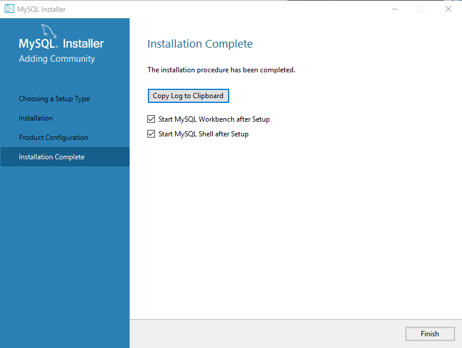

# MySQL Development Environment Setup Instructions

A guide to help aid the setup of your offline MySQL Development Environment for Windows 10 (with likely similar steps for other OSes), put together by Harrison Cassar (@harrisonCassar on Github). If you have any questions, feel free to message Harrison on the Bruin Hyperloop Slack at @HarrisonCassar, or email Harrison at Harrison.Cassar@gmail.com).

This guide is based closely on the steps presented in ProgrammingKnowledge's YouTube video: ["How to Install MySQL on Windows 10"](https://www.youtube.com/watch?v=WuBcTJnIuzo). Additionally, Programming with Mosh's ["MySQL Tutorial for Beginners [2019] - Full Course"](https://www.youtube.com/watch?v=7S_tz1z_5bA) also provides a step-by-step process for setup both for macOS and Windows in the video's first 15-20 minutes.

# Table of Contents

*  [Setup Dev Environment Steps](#setup-instructions)
*  [References and Links](#references-and-links)

# Setup Instructions

#### Download MySQL
First, we begin by downloading the [MySQL Community Server](https://dev.mysql.com/downloads/mysql/) as a part of the [MySQL Community Edition](https://www.mysql.com/products/community), which is the freely downloadable version of MySQL. It is available under the GPL license and is supported by a huge and active community of open source developers.

***NOTE:*** At the time of this guide's creation, the most-updated verison of the MySQL Community Server is 8.0.19. 

Since this tutorial is specifically for Windows 10, we will select the *Microsoft Windows* option from the *Select Operating System* drop-down menu. (At this point, if you are looking to setup a development environment for macOS or Linux, there are other options for those).

Click the *Go to Download Page* or *Download* button in the *Recommended Download* section.

You will now see two download options that look nearly identical. The difference lies in when the installer downloads the required files (can see the difference in the size and name of each of the installer files). The difference between the two is as follows:

***mysql-installer-web-community***: Initial download comprises of only the installer, later connecting to the web to download the remaining required files to install MySQL Community Server.
***mysql-installer-community***: Initial download comprises of ALL files necessary to complete the entire installation of the MySQL Community Server. For this tutorial, we chose **this option**.

Upon selection, you will be taken to another page asking you to login or signup to complete the download. Instead, scroll towards the bottom and click "No thanks, just start my download". Your download should automatically be started.

#### Install MySQL

Once the download completes (might take a few minutes depending on your internet speed), double-click the installer to begin the installation process. You may have to click "Yes" on a pop-up window from your computer asking if you "want to allow this app to install software on your PC".

Once the installer launches, start by selecting your installation type. For this guide, we are setting up a regular development environment, so the **Developer Default** option will work perfectly fine. This will install MySQL Server and the tools required for application development with MySQL. Descriptions for each option are provided upon selection.

Upon clicking "Next", a warning may pop-up mentioning the failure to find certain requirements.

For any requirements with "Manual" in the *Status* column, these must be manually resolved. If you click on the requirement, some *Requirement Details* are displayed, providing some information to potentially help the user meet this requirement. In the above example, Python 3.7 is not installed.

For requirements with nothing in the *Status* column (as depicted above), the MySQL Installer will automatically attempt to resolve the issue (therefore you don't have to do anything).

Simply click "Execute" to have the installer install all of the requirements automatically. During this process, there may be many other sub-installation windows that pop up. Make sure to properly follow the installation steps presented in each one.

When you are finished automatically and/or manually installing the requirements you need, click "Next". If a pop-up arises mentioning how "products with missing requirements will not be installed", assure yourself that you intend to not install the failed requirements, and click on "Yes" anyways.

Proceed to click "Execute" to perform the installation of each product. Once a certain product is successfully installed, a green checkmark will appear next to the product's name. If the installation fails, a red exclamation mark will instead appear. For these failed installations, you can attempt to fix these installations by finding the specific issues that the installer faced when installing each product by clicking on "Show Details". In the text presented, log messages prepended with "#:" are associated with the #th installed product.

In the above example, "MySQL Shell 8.0.19" and "Connector/ODBC 8.0.19" failed to install, where "MySQL Shell 8.0.19" failed to install because of a dependency on the Visual 2019 Redistributable, while the "Connector/ODBC 8.0.19" failed to install because of the lack of finding the file "MySQL ODBC 8.0 ANSI Driver". Attempt to fix these before moving on. ***NOTE: These errors were produced as an example by NOT pressing "Execute" on the previously-mentioned "Check Requirements" step of the installation process.***

#### Product Configuration

On the *Product Configuration* tab of the Installer, there will be a list of products to be configured. For this example, if you followed the previous steps, you should have 3 products to configure listed on the *Product Configuration* tab of the Installer:
* MySQL Server 8.0.19
* MySQL Router 8.0.19
* Samples and Examples 8.0.19

**NOTE:** The rest of this portion of the guide will be specifically regarding the configuration of these 3 products.

#### MySQL Server 8.0.19 Configuration

Clicking "Next" will bring you another series of tabs, where the first tab is labelled *High Availability*:

Since this guide is for specifically setting up a simple standalone development environment, we will be choosing the *Standalone MySQL Server / Classis MySQL Replication* option.

Click "Next" to proceed to a tab labeled *Type and Networking*:

**NOTE:** The default selections should be already selecting what we want for this guide. However, for the sake of completeness, we will still describe them as follows:

*Server Configuration Type*
For the *Server Configuration Type*, there are three options, which define how many system resources are assigned to the MySQL Server instance:
* **Development Computer:** This is a development computer, and many other applications will be installed on it. A minimal amount of memory will be used by MySQL.
* **Server Computer:** Several server applications will be running on this computer. Choose this option for web or application servers. MySQL will have medium memory usage.
* **Dedicated Computer:** This computer is dedicated to running the MySQL database server. No other servers, such as web servers, will be run. MySQL will make use of all available memory.

For this tutorial, since we are setting up a development environment, we choose the *Development Computer* option.

*Connectivity*
For the *Connectivity*, we will use TCP/IP as our communication protocol with **Port 3306**. This is the default port number for most MySQL services. The **X Protocol Port** is, by default, **33060**, which is obtained by multiplying the port number by 10. The X Protocol is a client server protocol implemented by the optional MySQL Server X Plugin, where application clients and their drivers feature the alternative protocol and a new X DevAPI programming API, which allows for an alternative way of accessing MySQL.

Click "Next" to proceed to a tab labeled *Authentication Method*:

For this guide, we will be using the default option "Use Strong Password Encryption for Authentication", as this is the recommended option for use with the MySQL 8 Server installation.

Click "Next" to proceed to a tab labeled *Accounts and Roles*:

In order to access the MySQL Server, you will need to provide a username and password with proper access permissions. On this configuration page, this is where you set up the Root Account password, as well as additional user accounts if needed.

In the "MySQL Root Password" and "Repeat Password" fields, enter a password of minimum length 4. Make sure you remember this password, as this allows you to have Root access permissions to the server. The strength of your password is dependent on the importance of security for your MySQL Server and the information it contains.

If you want to add more users in addition to the Root account, in the *MySQL User Accounts* section, click the "Add User" button.

In the fields provided, specify the new user's username and password, as well as the user's Host and Role. The role given to the user will determine the permissions that that user has for this specific server. **NOTE: The default is "DB Admin", which would give the added user executive privilege in performing any task on the database. Choose carefully!** For this setup, leave the Host as its default **<All Hosts (%)>** value, but change the Role accordingly. 

Once you have finished configuring the new user's information, click "Okay".

Once you have finished adding users, click on "Next" to proceed to the next tab labeled *Windows Service*:

In the "Windows Service Details" field, give the MySQL Server instance a name (by default, this value is likely "MySQL80", which represents the version number 8.0.19). Additionally, check/uncheck whether or not you would like the MySQL Server to start at System Startup, as well as specify under which user to run the MySQL Server under.

For the sake of this guide, we will leave everything as its default value.

Click "Next" to proceed to a tab labeled *Apply Configuration*:

To apply the configuration changes, click "Execute". Once these configuration changes have been successfully made, click "Finish".

#### MySQL Router 8.0.19 Configuration

Clicking "Next" will bring you to a tab labeled *MySQL Router Configuration*:

Since for this setup we are not working with a MySQL InnoDB cluster, we shall leave the "Configure MySQL Router for InnoDB cluster" option unchecked.  Click "Finish".

#### Samples and Examples 8.0.19 Configuration

Clicking "Next" will bring you to a tab labeled *Connect To Server*:

In the provided list of MySQL Server instances, select the server previously created and ran (for this guide specifically, the Server name is "MySQL Server 8.0.19"). Then, type in the root user's credentials as previously specified into the "User" and "Password" fields. Click "Check" to confirm the credentials' validity. Upon successful check, a green checkmark will appear next to the "Check" button, as well as the server gaining the status of "Connection succeeded".

Click "Next" to proceed to a tab labeled *Apply Configuration*:

To apply the configuration changes, click "Execute". Once these configuration changes have been successfully made, click "Finish".

#### Complete Installation

With all of the product configurations complete, click "Next", which brings you to a final *Installation Complete* tab:

If you would like to start MySQL Workbench and/or MySQL Shell after the setup is complete, then be sure to check the respective options on this tab (for this guide, we will leave both checked). Then, click "Finish" to finish the MySQL installation process.

### Connect MySQL Workbench to Database

Upon opening the MySQL Workbench, we first want to connect the database we are currently working on to the application. If a connection is not present under the *MySQL Connections* section of the welcome page, then we must add one by clicking on the "+" icon.

Give a name for this connection, and make sure the connection method is "Standard (TCP/IP)", as our server was initially setup to use TCP/IP for its communication protocol. Additionally, be sure to put "127.0.0.1" or "localhost" into the "Hostname" field (as our Server is being run locally), as well as ensuring the port is the same port you previously specified for the running TCP/IP port. Specify the name of the user to connect with in the "Username" field (use "root" if you want to have full "root" permissions, which is what we are doing in this guide) and enter the password for that user in the pop-up window resulting from clicking on the "Store in Vault..." button. To test if the connection is successful, you can click on the "Test Connection" button. Click the "OK" button when finished.

If the connection is successful, the connection should appear on the Welcome Page as depicted in the picture above. Every time you open MySQL Workbench, be sure to click on the connection to connect to the server you want to work with. A new interface should appear, looking like this:

And congratulations! You have a working development environment! Give yourself a pat on the back and have a cookie or two... you deserve it!

# References and Links
**Download Links**
* [MySQL Community Server](https://dev.mysql.com/downloads/mysql/)

**References**
* ProgrammingKnowledge's YouTube video: ["How to Install MySQL on Windows 10"](https://www.youtube.com/watch?v=WuBcTJnIuzo)
* Programming with Mosh's YouTube video: ["MySQL Tutorial for Beginners [2019] - Full Course"](https://www.youtube.com/watch?v=7S_tz1z_5bA)